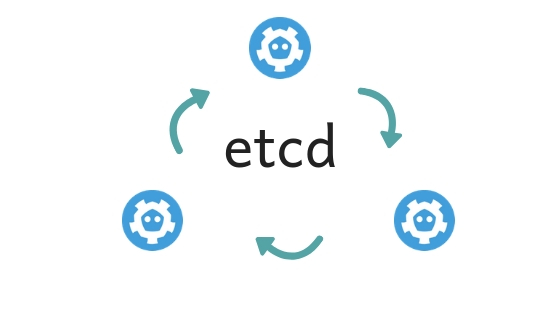

# ETCD Cluster with `Ansible` and `Vagrant` 

Prerequisites :

- [vagrant](https://www.vagrantup.com/downloads.html)
- [ansible](https://docs.ansible.com/ansible/latest/installation_guide/intro_installation.html)

# Issue the following command and go for a coffee it will be done shortly :
```
$ ansible-playbook -i hosts deploy-etcd.yaml
```
and boom, thats it!

<p align="center">
  
</p>

# Manual Installation
First of all lets confirm what we have:

|Role|FQDN|IP|
|----|----|----|
|ETCD Cluster Node|etcd01.gwf.me|192.168.56.111|
|ETCD Cluster Node|etcd02.gwf.me|192.168.56.112|
|ETCD Cluster Node|etcd03.gwf.me|192.168.56.113|
> Well we have virtualbox so the IP range could be familiar to anyone 

## On your local workstation (Linux)

#### Generate TLS certificates
##### Download latest version of cfssl/cfssljson binaries
```
{
  VERSION=$(curl --silent "https://api.github.com/repos/cloudflare/cfssl/releases/latest" | grep '"tag_name"' | sed -E 's/.*"([^"]+)".*/\1/')
  VNUMBER=${VERSION#"v"}
  wget https://github.com/cloudflare/cfssl/releases/download/${VERSION}/cfssl_${VNUMBER}_linux_amd64 -O cfssl
  wget https://github.com/cloudflare/cfssl/releases/download/${VERSION}/cfssljson_${VNUMBER}_linux_amd64 -O cfssljson
  chmod +x cfssl cfssljson
  sudo mv cfssl cfssljson /usr/local/bin/
}
```
##### Create a Certificate Authority (CA)
> We then use this CA to create other TLS certificates
```
{

cat > ca-config.json <<EOF
{
    "signing": {
        "default": {
            "expiry": "8760h"
        },
        "profiles": {
            "etcd": {
                "expiry": "8760h",
                "usages": ["signing","key encipherment","server auth","client auth"]
            }
        }
    }
}
EOF

cat > ca-csr.json <<EOF
{
  "CN": "etcd cluster",
  "key": {
    "algo": "rsa",
    "size": 2048
  },
  "names": [
    {
      "C": "IR",
      "L": "Iran",
      "O": "myfirm",
      "OU": "DevOps",
      "ST": "Tehran"
    }
  ]
}
EOF

cfssl gencert -initca ca-csr.json | cfssljson -bare ca

}
```
##### Create TLS certificates
```
{

cat > etcd-csr.json <<EOF
{
  "CN": "etcd",
  "hosts": [
    "localhost",
    "127.0.0.1",
    "192.168.56.111",
    "192.168.56.112",
    "192.168.56.113"
  ],
  "key": {
    "algo": "rsa",
    "size": 2048
  },
  "names": [
    {
      "C": "IR",
      "L": "Iran",
      "O": "myfirm",
      "OU": "DevOps",
      "ST": "Tehran"
    }
  ]
}
EOF

declare -a MYNODES=(etcd1 etcd2 etcd3)
for i in ${MYNODES[@]}; do
  cfssl gencert -ca=ca.pem -ca-key=ca-key.pem -config=ca-config.json -profile=etcd etcd-csr.json | cfssljson -bare $i
done
}
```
> Change C,L,OU,ST to fit your desire.
##### Copy the certificates to etcd nodes acordingly
```
{
  for i in {1..3}; do
    scp ca.pem etcd$i.pem etcd$i-key.pem root@192.168.56.11$i:~/
  done
}
```
## On all etcd-nodes

> Perform all commands logged in as **root** / **sudo** user
```
{
  MYFILENAME=etcd`hostname -i | cut -d. -f4 | cut -d1 -f 3` #This will create name based on our last digit of our last octet of current machine
  mkdir -p /etc/etcd/pki
  mv ca.pem /etc/etcd/pki/ca.pem
  mv $MYFILENAME.pem /etc/etcd/pki/etcd.pem
  mv $MYFILENAME-key.pem /etc/etcd/pki/etcd-key.pem
}
```
##### Download etcd from github.com and put it on a proper folder
```
{
  ETCD_VER=$(git ls-remote --tags https://github.com/etcd-io/etcd/ | sort -t '/' -k 3 -V | grep -v "\^{}" | tail -1 | awk -F/ '{print $3}')
  cd /tmp && wget -q --show-progress "https://github.com/etcd-io/etcd/releases/download/${ETCD_VER}/etcd-${ETCD_VER}-linux-amd64.tar.gz"
  tar zxf etcd-${ETCD_VER}-linux-amd64.tar.gz
  mv etcd-${ETCD_VER}-linux-amd64/etcd* /usr/local/bin/
  rm -rf etcd-${ETCD_VER}-linux-amd64
}
```

##### Create systemd unit file for etcd service on each servers
> We assumed servers have only one interface so we can use hostname -i
```
{
  NODE_IP=$(hostname -i)
  ETCD_HOSTNAME=$(hostname -s)
}
cat <<EOF >/etc/systemd/system/etcd.service
[Unit]
Description=etcd
[Service]
Type=notify
ExecStart=/usr/local/bin/etcd \\
  --name ${ETCD_HOSTNAME} \\
  --cert-file=/etc/etcd/pki/etcd.pem \\
  --key-file=/etc/etcd/pki/etcd-key.pem \\
  --peer-cert-file=/etc/etcd/pki/etcd.pem \\
  --peer-key-file=/etc/etcd/pki/etcd-key.pem \\
  --trusted-ca-file=/etc/etcd/pki/ca.pem \\
  --peer-trusted-ca-file=/etc/etcd/pki/ca.pem \\
  --peer-client-cert-auth \\
  --client-cert-auth \\
  --initial-advertise-peer-urls http://${NODE_IP}:2380 \\
  --listen-peer-urls http://${NODE_IP}:2380 \\
  --advertise-client-urls http://${NODE_IP}:2379 \\
  --listen-client-urls http://${NODE_IP}:2379,http://127.0.0.1:2379 \\
  --initial-cluster-token etcd-cluster-1 \\
  --initial-cluster etcd1=http://192.168.56.111:2380,etcd2=http://192.168.56.112:2380,etcd3=http://192.168.56.113:2380 \\
  --initial-cluster-state new
Restart=on-failure
RestartSec=5
[Install]
WantedBy=multi-user.target
EOF
```
> Note: Please mind the `\\` , that is for escapeing `\`
##### Enable and Start etcd service
```
{
  systemctl daemon-reload 
  systemctl enable --now etcd 
  systemctl status -l etcd.service
}
```

#### Verify ETCD cluster status
> Below command could be issued on any server of our cluster
```
ETCDCTL_API=3 etcdctl \
  --endpoints=https://127.0.0.1:2379 \
  --cacert=/etc/etcd/pki/ca.pem \
  --cert=/etc/etcd/pki/etcd.pem \
  --key=/etc/etcd/pki/etcd-key.pem \
  member list
```
#### Create and verify some key-value pair

```
alias etcdctls='etcdctl --endpoints=https://127.0.0.1:2379 --cacert=/etc/etcd/pki/ca.pem --cert=/etc/etcd/pki/etcd.pem --key=/etc/etcd/pki/etcd-key.pem'
```
> To avoid typing ssl options for etcdctl each time we can simply make an alias for that (there are many ways for that as you may already know!)
```
ETCDCTL_API=3 etcdctls put name1 Arash
ETCDCTL_API=3 etcdctls put name2 Giti
ETCDCTL_API=3 etcdctls put name3 Rostam
ETCDCTL_API=3 etcdctls put name4 Shirin
ETCDCTL_API=3 etcdctls put name5 Kourosh
```
now we can check it like below :
```
ETCDCTL_API=3 etcdctls get name3         # >the value of key:name3 should be the output
ETCDCTL_API=3 etcdctls get name1 name4   # >lists range name1 to name 4
ETCDCTL_API=3 etcdctls get --prefix name # >lists all keys with name prefix
```
